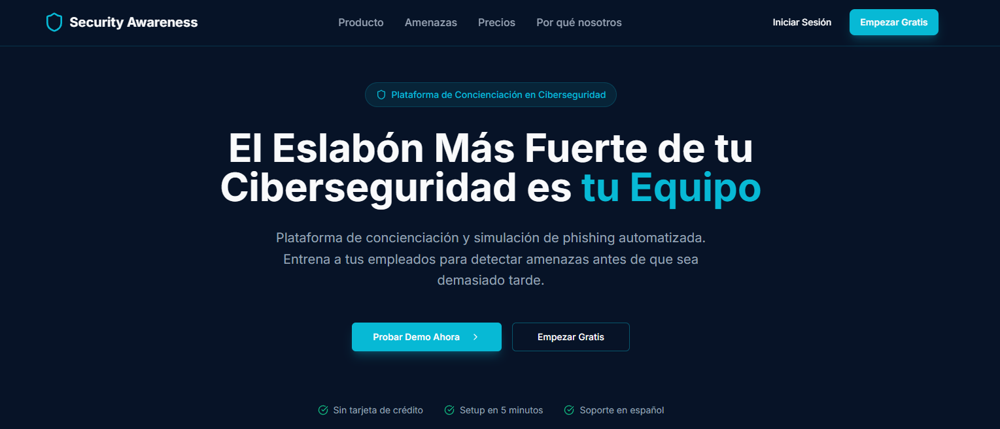
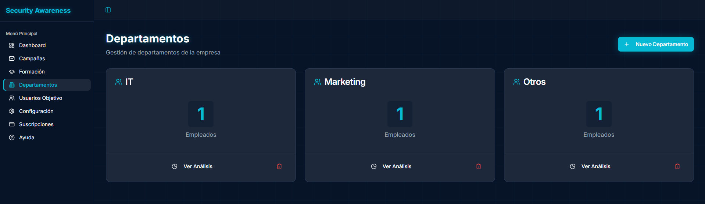
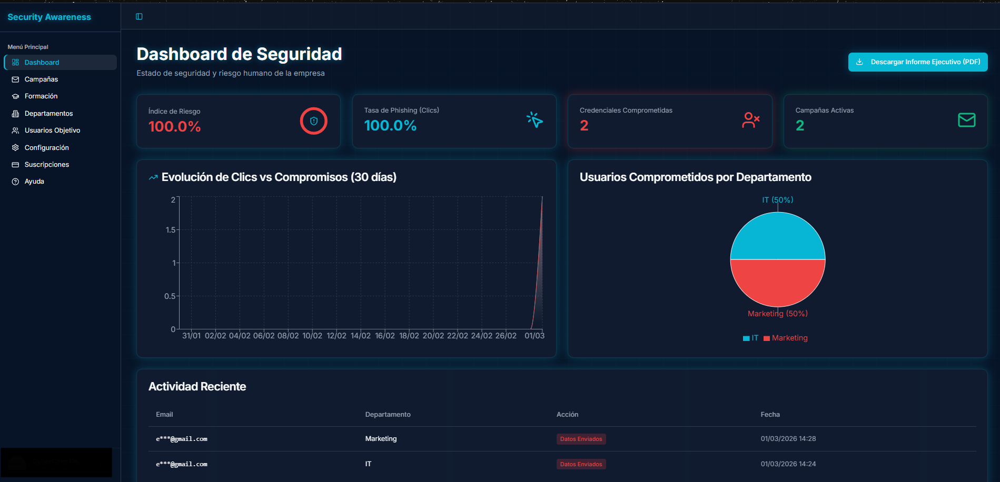

# Phishing Simulation SaaS - Educational Platform (TFG)

> **Status:** Final Degree Project (TFG) - Cybersecurity
> **Focus:** Security Awareness, Phishing as a Service (PhaaS), Secure Architecture
> **Tech Stack:** React, Vite, Supabase (PostgreSQL), OpenAI API
> 🌍 **Live Demo:** [securityawareness.tech](https://securityawareness.tech/)

Plataforma SaaS de simulación de Phishing y concienciación en ciberseguridad orientada a PYMES. Diseñada desde cero con un enfoque integral en la seguridad defensiva, automatización con IA y arquitectura de software segura.

⚠️ **Disclaimer:** Proyecto estrictamente educativo y defensivo. Diseñado para entrenar a empleados y mejorar la postura de seguridad de las organizaciones.

---

### 👥 Equipo de Desarrollo

* **Kenner Letelier**: Lógica Core, Backend, Integración API (OpenAI), Seguridad y Base de Datos. ([LinkedIn](https://www.linkedin.com/in/kenner-letelier/))
* **Gabriel Gangi**: Frontend (React/Vite), UI/UX, Seguridad y Base de Datos. ([LinkedIn](https://www.linkedin.com/in/gabrielgangi/))

---

### ⚙️ Flujo de Trabajo y Funcionalidades (Workflow)

La plataforma gestiona el ciclo de vida completo de una simulación de phishing, desde la creación de la infraestructura hasta la generación de informes ejecutivos.

#### 1. Gestión de Organización
El administrador inicia sesión, crea los departamentos de la empresa y añade los usuarios objetivo, asignándolos a sus respectivas áreas para segmentar el riesgo humano.
  

#### 2. Configuración de la Campaña
Se define una nueva campaña de concienciación, especificando el departamento objetivo y estableciendo las fechas de inicio y fin de la simulación.

#### 3. Diseño del Ataque impulsado por IA
El motor integrado con OpenAI genera dinámicamente el contenido del ataque. El administrador escribe libremente el contexto o la temática deseada (ej. "Recuperar contraseña de Netflix"), selecciona un remitente ficticio, y la IA redacta el cuerpo del correo basándose exactamente en ese *prompt*.
 

#### 4. Ejecución del Ataque y Recopilación (Tracking)
Al lanzar la campaña, se envían los correos controlados. El sistema recopila interacciones reales: correos enviados, enlaces clicados y datos introducidos. Las páginas de aterrizaje replican servicios reales (ej. Netflix) para evaluar la capacidad de detección.
*A la izquierda: Email malicioso recibido. A la derecha: Landing page falsa simulada.*

| Correo Recibido | Landing Page Falsa (Netflix) |
| :---: | :---: |
| Media/Mail recibido.png | Media/phising.png |

#### 5. Monitorización en Tiempo Real
Panel de control (Dashboard) que consolida las métricas de compromiso: Índice de Riesgo global, Tasa de Phishing (Clics), y Credenciales Comprometidas por departamento y usuario.

 

#### 6. Reportes Ejecutivos Automatizados
Descarga de informes detallados en PDF específicos por campaña o reportes ejecutivos globales evaluados. Incluyen un análisis de riesgos y un plan de mitigación.

[text](Media/Reporte_Ejecutivo_1.pdf)

---

### 🔒 Modo Demo (Sandbox Público)

Para permitir la evaluación de la herramienta sin riesgos de abuso, se implementó una arquitectura de Sandbox automatizada con restricciones estrictas a nivel de backend y base de datos:

* **Autoconfiguración y Acceso Directo:** Al hacer clic en "Probar Demo" e introducir un correo, el sistema envía un *Magic Link* que otorga acceso directo e inmediato a la plataforma temporal sin necesidad de contraseñas durante solo 2 horas.
* **Restricción "Self-Phishing Only":** Bloqueo a nivel de Base de Datos que garantiza que los correos de prueba **solo** pueden enviarse a la misma dirección de correo utilizada para generar la Demo, evitando el spam o ataques a terceros.
* **Hard Limits (SQL Triggers):** El entorno está limitado mediante Triggers y funciones RPC (`SECURITY DEFINER`) a un máximo de 2-3 usuarios y 2 departamentos por sesión de 2 horas (UTC).
* **Seguridad de Datos:** La plataforma **nunca** almacena contraseñas reales en texto plano durante las simulaciones; únicamente registra la acción de vulnerabilidad para métricas.